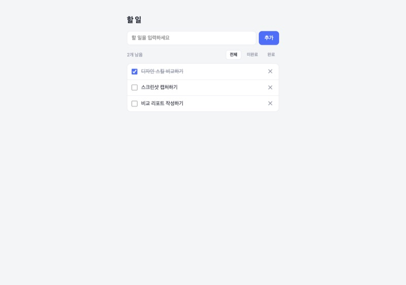
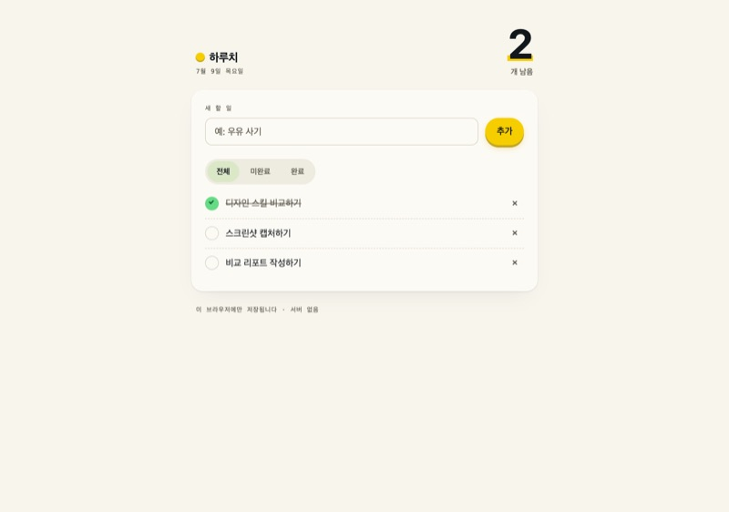
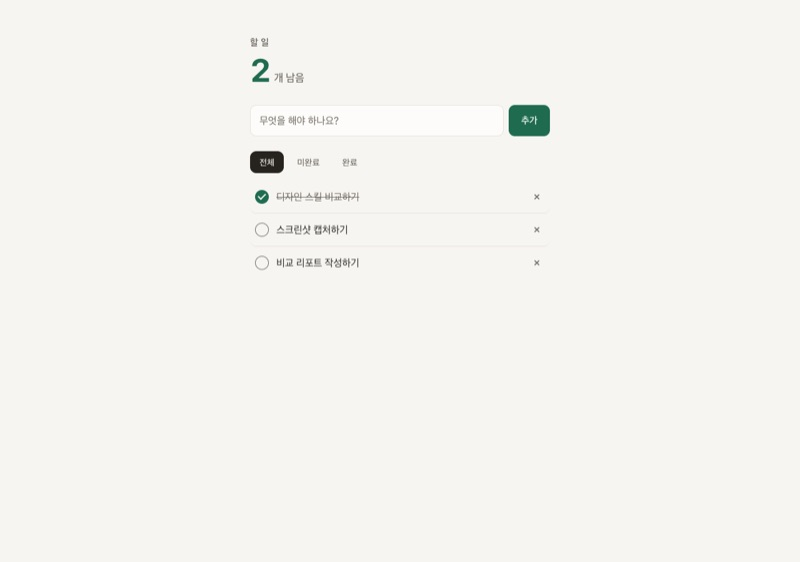
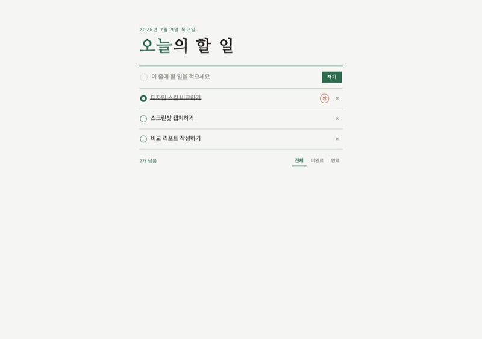
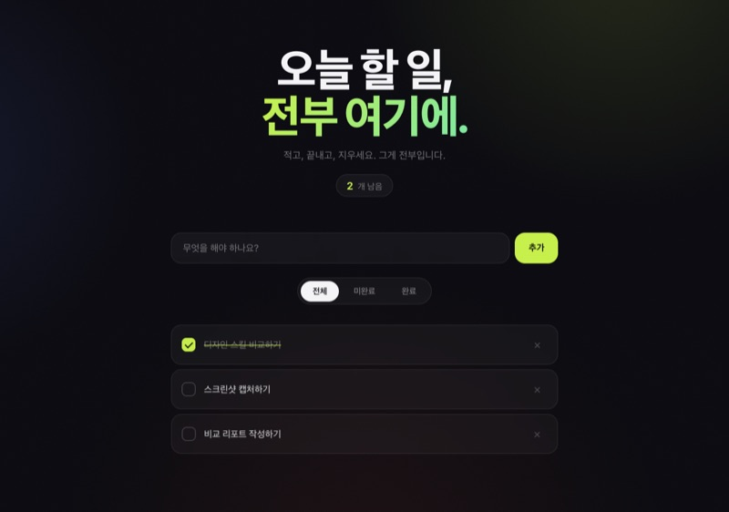
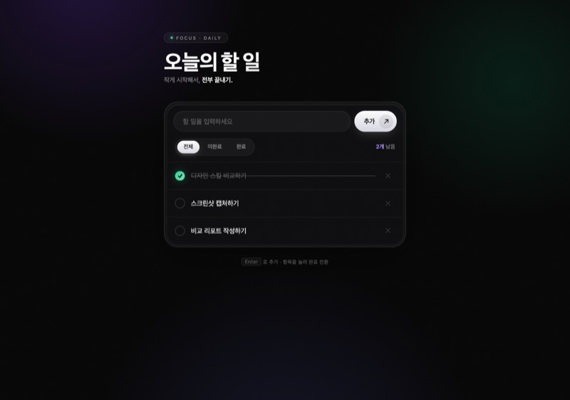
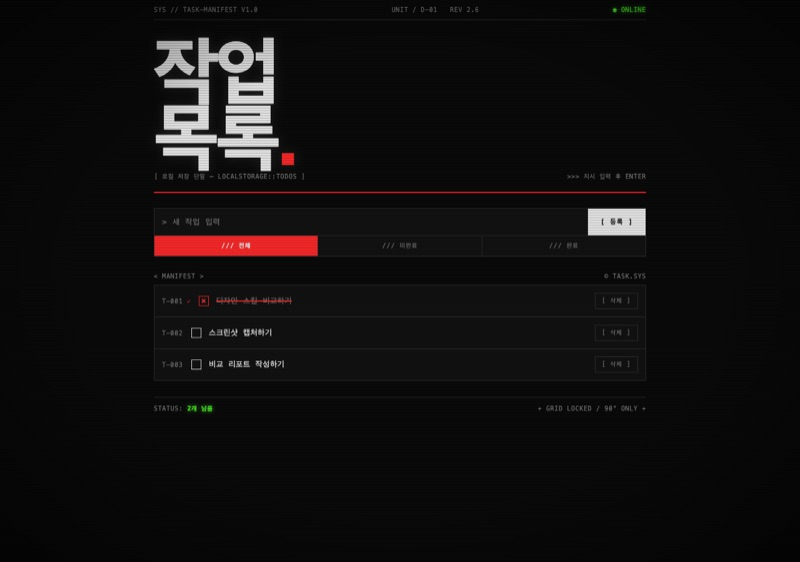
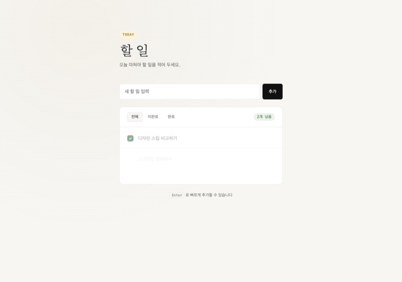

디자인 스킬을 하나 붙이면 결과물이 정말 좋아지는가, 아니면 토큰만 더 태우는가. 말로는 답이 안 난다. 그래서 변수를 하나만 남기고 전부 고정했다. **똑같은 투두 앱 명세를 8개의 에이전트에 던지고, 7개에는 각각 다른 디자인 스킬을, 1개에는 아무 스킬도 주지 않았다.** 기능이 상수가 되면 남는 차이는 오직 두 가지 — 디자인과 비용이다.

## 결론부터

결과는 셋으로 요약된다.

1. **기능은 스킬 없이도 완성된다.** 8종 전원이 기능 검증을 통과했다. 그러니 디자인 스킬에 지불하는 값은 기능이 아니라 **오로지 디자인 품질**이다.
2. **품질 천장은 비용에 대체로 비례한다.** 자체 검증 루프(슬롭 게이트·프리플라이트)를 도는 스킬일수록 디테일이 촘촘하고, 그만큼 토큰과 시간을 많이 먹는다. baseline 29k에서 hallmark 167k까지, 약 5.7배가 벌어졌다.
3. **정답 스킬은 없고 용도별 스킬이 있다.** 제품 UI, 데모 임팩트, 개발자 도구, 저비용 톤업 — 목적이 다르면 이기는 스킬도 다르다.

아래는 이 세 문장을 지탱하는 데이터와 8장의 실물이다.

## 실험 설계 — 왜 병렬 독립 에이전트인가

비교 실험의 최대 적은 오염이다. 한 컨텍스트에서 8개를 순서대로 만들면, 앞서 만든 디자인이 뒤 결과에 스며든다. 그래서 **스킬당 독립 서브에이전트 1개를 깨끗한 컨텍스트에서 병렬로 띄웠다.** 각 에이전트는 자기에게 배정된 스킬 문서만 읽고, baseline 에이전트는 어떤 스킬 문서에도 접근하지 못한다. 서로의 결과를 볼 수 없으니 참고할 길이 처음부터 막힌다.

이 "독립·병렬·오염 방지" 구조는 [[에이전트-평가-evals]]에서 말하는 평가 격리 원칙을 그대로 따른 것이다. 공정한 비교는 조건을 붙이는 게 아니라 빼는 데서 나온다.

명세는 단일 파일 `index.html`(HTML/CSS/JS 인라인), vanilla 스택만, **외부 CDN·외부 폰트·프레임워크 금지**, 한국어 UI로 고정했다. 기능은 6개 — 추가, 완료 토글, 삭제, 필터 3종(전체·미완료·완료), 남은 개수 표시, localStorage 저장이다.

검증도 눈대중이 아니라 실측이다. 실제 Chrome에서 6개 기능을 전수 구동해 보고, 콘솔 에러를 셌고, 375px 뷰포트에서 `scrollWidth`를 측정해 가로 오버플로를 확인했다. **결과: 8종 전원 6기능 통과, 콘솔 에러 0건, 375px 오버플로 0건.** 기능이 완벽한 상수가 됐다는 뜻이고, 이제부터 이야기는 전부 디자인과 비용이다.

## 전체 스코어보드

| 케이스 | 디자인 방향 | 토큰 | 소요시간 | 파일 크기 |
|---|---|---:|---:|---:|
| baseline (스킬 없음) | 흰 카드 + 인디고 버튼, 전형적 AI 스타일 | 29k | 3분 | 5.8KB |
| minimalist-ui | 웜 본화이트 + 세리프 제목, 에디토리얼 미니멀 | 35k | 14분 | 10.1KB |
| frontend-design (공식) | 원고지 괘선 + 완료 시 인주 「완」 도장 | 36k | 11분 | 9.8KB |
| industrial-brutalist-ui | CRT 단말: 스캔라인, T-001 채번, ASCII 프레임 | 36k | 11분 | 11.7KB |
| gpt-taste | 시네마틱 다크 + 초대형 히어로 타이포 + 라임 액센트 | 37k | 11분 | 13.0KB |
| high-end-visual-design | OLED 블랙 + 글래스 카드 + 메시 그라데이션 오브 | 40k | 14분 | 15.7KB |
| design-taste-frontend | 웜 스톤 + 포레스트 그린 1색, 캄 제품 UI (다크모드 자동) | 77k | 23분 | 10.6KB |
| hallmark | '하루치' 브랜딩: 크림 종이 + 옐로, 눌리는 버튼, 점선 시임 | 167k | 64분 | 18.5KB |

토큰·시간은 서브에이전트 1회 실행 기준이다. 눈에 띄는 건 비용의 편차다. 대부분의 스킬이 35–40k 구간(baseline 대비 +25% 안팎의 가벼운 프리미엄)에 몰려 있는데, design-taste-frontend(77k)와 hallmark(167k)만 궤도를 이탈했다. 이 둘의 공통점이 뒤에서 핵심이 된다.

## 케이스별 실물

### baseline — 스킬의 효과를 재는 영점

**스킬 없음.** 어떤 디자인 문서도 주지 않은 대조군이다. 모델의 기본 취향이 그대로 나온다.

누구나 아는 그 AI 투두 앱이다. 흰 카드, 인디고 CTA, 시스템 산세리프, 중앙 정렬 컬럼. 기능적으로 완벽하고 가장 싸고 빠르지만(29k·3분), "생성된 UI"라는 인상을 지울 수 없다. 나쁜 게 아니라 **무색무취**하다. 나머지 7종은 전부 이 영점에서 얼마나 멀어졌는가로 읽으면 된다.

- **장점** — 가장 싸고 빠르다(29k·3분). 파일도 5.8KB로 가장 가볍다. 디자인이 안 중요한 단계면 이게 정답이다.
- **단점** — 브랜드도 콘셉트도 없다. 어느 AI가 뽑아도 비슷하게 나오는, 대체 가능한 결과물.
- **디자이너 관점** — 시각 위계가 사실상 **버튼 색 하나(인디고)에만 의존**한다. 타이포 스케일 대비는 약하고 여백은 기본값, 마이크로인터랙션은 없다. 정보는 읽히지만 '누가 만든 화면'인지는 읽히지 않는다.

### hallmark — 가장 '제품 같음', 가장 비쌈

**Nutlope(Hassan El Mghari)의 안티-AI-슬롭 스킬.** 신규 페이지·audit·redesign·URL/스크린샷에서 디자인 DNA를 추출하는 study까지 동사 체계를 갖췄고, 슬롭 게이트 58종과 장르(genre)·테마 시스템을 얹은 8종 중 가장 무거운 스킬이다.

8종 중 유일하게 앱에 **이름('하루치')과 브랜드 세계관**을 만들었다. 크림 종이 질감, 페어/코랄 멀티 액센트, 눌리는 엣지 섀도 버튼, 전부 완료했을 때 뜨는 코랄 모먼트 같은 마이크로 디테일까지 챙겼다. 대가는 압도적이다 — baseline의 5.7배 토큰, 약 20배 시간. 레퍼런스 문서를 30회 로드하고 자체 슬롭 게이트 58종을 통과시키느라 그렇다. **품질 천장이 가장 높고 비용도 가장 높다.**

- **장점** — 브랜드 세계관과 마이크로 디테일. 앱에 이름·성격·완료 모먼트까지 붙어 '제품'처럼 완결된다. 첫인상이 전부인 자리에서 값을 한다.
- **단점** — 막대한 비용. 167k 토큰·64분은 baseline의 5.7배·약 20배다. 사용자가 3초 보고 닫는 화면에 쓸 예산이 아니다.
- **디자이너 관점** — 멀티 액센트(페어/코랄)를 위계에 맞게 배분하고, 종이 질감·점선 시임으로 촉각적 아이덴티티를 만든다. 눌리는 엣지 섀도는 물리적 피드백을 주는 마이크로인터랙션. 타이포·컬러·모션·브랜드 네 축이 모두 채워진, 사실상 유일한 케이스다.

### design-taste-frontend — 절제의 완성도, 중간 비용

**커뮤니티 taste-skill 모음의 대표 스킬(v2).** 랜딩·포트폴리오·리디자인용 안티-슬롭 스킬로, 템플릿처럼 보이지 않는 UI를 목표로 삼는다. 액센트 1색 잠금·em-dash 금지 같은 자체 프리플라이트 체크를 강제하는 게 특징.

이 프리플라이트를 **실제로 수행했다.** 액센트 1색(포레스트 그린) 잠금, em-dash 금지, 라디우스 시스템 단일화까지. 토큰 2위(77k)인 이유가 여기 있다. 8종 중 유일하게 라이트/다크 모드를 자동 대응한다.

- **장점** — 절제된 완성도. 실제 제품에 그대로 넣어도 어색하지 않고, 자동 다크모드까지 붙어 프로덕션 대응력이 가장 높다.
- **단점** — 화려하지 않다. 데모 임팩트가 목적이면 밋밋하게 보일 수 있고, 비용도 중상위(77k)다.
- **디자이너 관점** — **액센트 1색 잠금 + 라디우스 단일화**로 시각적 일관성이 프로덕션 수준이다. 위계는 색이 아니라 타이포 스케일과 여백으로 세운다. 오래 봐도 피로하지 않은 '캄(calm) 디자인'의 교과서적 구현.

### frontend-design (공식) — 콘셉트의 힘

**Anthropic 공식 플러그인.** 특정 스타일을 강제하지 않고, "의도적이고 비템플릿적인 시각 디자인"의 방향성과 타이포 원칙만 제시한다. 규칙집이 아니라 안목을 주입하는 쪽에 가깝다.

"할 일을 종이에 적는다"는 메타포를 원고지 괘선 + 먹줄 취소선 + 완료 시 인주 「완」 도장으로 구현했다. **저비용(36k)으로 8종 중 가장 기억에 남는 결과**를 냈다.

- **장점** — 문화적 메타포를 저비용 고임팩트로 뽑는다. 36k로 hallmark에 준하는 인상을 남긴 유일한 케이스다.
- **단점** — 스타일을 강제하지 않으니 결과가 프롬프트·주제 운에 좌우된다. 아이디어가 잘 걸리면 크게 이기고, 안 걸리면 평범해지는 편차가 있다.
- **디자이너 관점** — 컬러 시스템이나 그림자가 아니라 **콘셉트**(원고지·인주)로 아이덴티티를 세운다. 완료 시 도장 모먼트는 기능(토글)과 은유(승인)를 겹친 마이크로인터랙션. 적은 시각 요소로 강한 서사를 만드는 편집 감각이 돋보인다.

### gpt-taste — 랜딩페이지가 된 투두

**같은 taste-skill 모음 소속.** GSAP 스크롤 모션·AIDA 페이지 구조·대형 에디토리얼 타이포·벤토 그리드를 강제하는 랜딩페이지 지향 스킬이다. 애초에 투두 앱이 아니라 마케팅 페이지를 겨냥해 설계됐다.

그래서 투두 앱을 히어로 카피("오늘 할 일, 전부 여기에.")가 붙은 시네마틱 페이지로 해석했다. 흥미로운 건 마찰이다. 스킬이 요구하는 GSAP·외부 이미지가 brief의 **CDN 금지 제약과 충돌**해, vanilla WAAPI + 인라인 SVG로 대체됐다.

- **장점** — 초대형 타이포와 시네마틱 다크로 순간 임팩트가 크다. 랜딩·히어로 섹션이 필요한 자리에선 강하다.
- **단점** — **제약과 충돌하면 희석된다.** GSAP를 못 쓰자 이 스킬의 핵심 무기(스크롤 모션)가 빠졌다. 스킬을 고를 때 제약 호환성부터 봐야 하는 이유.
- **디자이너 관점** — 타이포 스케일 대비는 8종 중 가장 공격적이고, 라임 액센트로 다크 위에 초점을 만든다. 다만 투두라는 도구성 UI에 랜딩 문법을 씌운 탓에 **폼과 콘텐츠의 정합성**은 낮다. 좋은 스킬도 용도에 맞지 않으면 힘을 잃는다는 표본.

### high-end-visual-design — 프리미엄 다크의 정석

**같은 taste-skill 모음 소속.** "고급 에이전시처럼" 만들라는 스킬로, 폰트·간격·그림자·카드 구조를 구체 수치로 규정하고, AI가 흔히 뽑는 밋밋한 기본값을 배제한다.

글래스모피즘 더블 베젤 카드, 라디얼 오브, 필름 그레인. 스킬이 정의한 "Ethereal Glass" 아키타입이 그대로 나왔다(40k).

- **장점** — 규정된 수치 덕에 완성도가 안정적으로 높다. 그림자·간격이 어설프게 무너지지 않는다.
- **단점** — 어디서 본 듯한 프리미엄 다크 계열이라 독창성은 중간이다. 아키타입이 강한 만큼 결과도 뻔한 쪽으로 수렴한다.
- **디자이너 관점** — 그림자·블러·베젤의 **깊이(depth) 운용**이 정교하고 여백도 넉넉하다. 브랜드보다 '질감'으로 고급감을 낸다. 안전하게 프리미엄해 보이고 싶을 때의 선택지지만, 남과 구별되긴 어렵다.

### industrial-brutalist-ui — 가장 급진적

**같은 taste-skill 모음 소속.** 스위스 인쇄 타이포와 군용 터미널 미학을 결합하는 스킬로, 데이터 밀집 대시보드·개발자 도구를 겨냥한다.

그 정체성대로 투두를 "작업 목록 단말(TASK//MANIFEST)"로 재해석했다. T-001 채번, `[ 등록 ]` ASCII 버튼, 스캔라인 오버레이, STATUS 표시줄.

- **장점** — 톤이 가장 확실하다. 개발자 도구·내부 대시보드처럼 '기계 같음'이 신뢰로 읽히는 자리에서 강력하다.
- **단점** — 범용성이 낮다. 호불호가 극명하고, 일반 소비자 제품에 쓰면 이질감이 크다.
- **디자이너 관점** — **모노스페이스 + 극단적 타입 스케일 대비**로 위계를 세우고, 채번(T-001)·STATUS 같은 시스템 은유로 아이덴티티를 만든다. 컬러는 기능색으로 최소화, 스캔라인은 아날로그 질감을 더하는 장식. 목적이 뚜렷한 만큼 폼과 콘텐츠의 정합성은 gpt-taste와 정반대로 높다.

### minimalist-ui — 안전한 상향

**같은 taste-skill 모음 소속.** 웜 모노크롬·타이포 대비·플랫 벤토 그리드의 에디토리얼 미니멀 전용 스킬이다. 그라데이션과 무거운 그림자를 금지한다.

baseline에서 가장 가까운 거리에 있지만, 세리프 에디토리얼 제목 + 웜 뉴트럴 + 헤어라인 보더 + TODAY 배지로 확실한 **톤이 생겼다.**

- **장점** — 최소 비용(35k, baseline +6k)으로 generic함을 벗는 가성비. 큰 모험 없이 'AI가 생성한 듯한 인상'만 걷어낸다.
- **단점** — 변별력은 약하다. 안전한 만큼 강한 인상이나 브랜드는 없다. 데모용으로는 밋밋하다.
- **디자이너 관점** — 그림자 대신 **헤어라인 보더와 세리프/산세리프 대비**로 위계를 세우는 정공법. 웜 뉴트럴 팔레트로 온기를 더하고 여백을 넉넉히 쓴다. 화려함을 뺀 자리를 타이포와 여백으로 채우는, 미니멀의 정석적 접근.

## 트레이드오프 — 이 실험이 말하지 않는 것

데이터를 곧이곧대로 일반화하면 위험하다. 경계는 분명히 해 두자.

- **투두 앱 한 번의 결과다.** 표본 n=1이다. 같은 스킬도 주제(대시보드·랜딩·포트폴리오)가 바뀌면 순위가 달라질 수 있다. 특히 콘셉트 드리븐 스킬(frontend-design)은 편차가 크다.
- **비용 수치는 1회 실행 스냅샷이다.** 서브에이전트 실행 1번의 토큰·시간이며, 재현 시 ±편차가 있다. 절대값보다 자릿수(35k대 vs 77k vs 167k)로 읽는 게 안전하다.
- **디자인 '좋음'은 주관이다.** 기능 통과는 객관적으로 측정했지만, 어느 디자인이 우월한지는 용도와 취향의 함수다. 이 글은 순위표가 아니라 성향표로 읽어야 한다.
- **제약이 다르면 결과도 다르다.** CDN·외부 폰트를 허용했다면 gpt-taste·high-end 계열이 훨씬 유리했을 것이다. 여기 결과는 "단일 파일·외부 의존 0" 제약 아래의 순위다.

한계를 뒤집으면 이 실험이 확실히 증명한 것도 또렷해진다. **동일 제약·동일 명세·동일 검증 아래에서, 기능은 상수였고 디자인과 비용만 변했다.** 그 인과만큼은 n=1이어도 유효하다.

## 설치 방법

세 갈래다. taste 계열 5종은 커뮤니티 `skills` CLI로, hallmark도 같은 CLI로, frontend-design은 Claude Code 공식 마켓플레이스로 설치한다.

| 스킬 | 설치 명령/방법 | 설치 경로 |
|---|---|---|
| taste 계열 5종 (design-taste-frontend, gpt-taste, high-end-visual-design, minimalist-ui, industrial-brutalist-ui) | `npx -y skills add -g Leonxlnx/taste-skill` | `~/.claude/skills/<스킬명>/` |
| hallmark | `npx -y skills add -g nutlope/hallmark` | `~/.claude/skills/hallmark/` |
| frontend-design | `/plugin` → 공식 마켓플레이스에서 frontend-design 설치 | `~/.claude/plugins/cache/claude-plugins-official/frontend-design/` |

`skills` CLI의 텔레메트리를 끄려면 명령 앞에 `DO_NOT_TRACK=1`을 붙인다 (예: `DO_NOT_TRACK=1 npx -y skills add -g nutlope/hallmark`).

## 실무 적용 — 그래서 뭘 붙일까

CTO 관점의 판단 기준은 단순하다. **결과물의 수명과 노출 면적으로 스킬 등급을 정하라.**

| 상황 | 추천 | 이유 |
|---|---|---|
| 실제 출시 제품 UI | design-taste-frontend | 자동 다크모드 + 절제된 시스템, 오래 봐도 안 질림 |
| 데모·투자 피칭·쇼케이스 | hallmark 또는 frontend-design | 첫인상 임팩트 최대, 비용은 일회성이라 감내 가능 |
| 개발자 도구·내부 대시보드 | industrial-brutalist-ui | '기계 같음'이 오히려 신뢰감 |
| 빠른 저비용 톤업 | minimalist-ui | +6k로 generic 탈출, 가성비 |
| 프로토타입·기능 검증 | baseline (스킬 없음) | 디자인이 안 중요한 단계면 29k가 정답 |

핵심 판단 하나만 남기면 이렇다. **167k를 쓸 가치가 있는 화면인가?** 사용자가 3초 보고 닫는 내부 툴이면 아니다. 회사의 첫인상을 좌우하는 랜딩이면 그렇다. 슬롭 게이트를 도는 비싼 스킬(hallmark·design-taste-frontend)은 "여기서 디테일 밀도가 매출/신뢰로 환산되는가"라는 질문에 예스일 때만 켜라.

그리고 어떤 스킬을 켜든, **프로젝트 제약과 스킬 지침의 충돌부터 확인하라.** gpt-taste가 GSAP를 못 써서 힘이 빠진 것처럼, 제약과 안 맞는 스킬은 값만 치르고 효과는 반감된다. 이건 [[하네스-엔지니어링]]에서 말하는 "도구와 환경의 정합성" 문제 그대로다. 스킬은 하네스의 일부이고, 하네스는 제약 안에서만 작동한다.

관련: [[에이전트-평가-evals]] · [[하네스-엔지니어링]] · [[위키-하네스]] · [[에이전틱-엔지니어링]]

## 출처

- 실험 원자료 — 본 실험의 리포트(`report.md`)와 공통 명세(`brief.md`). 8종 전수 기능 검증(Chrome 실구동, 콘솔 에러 카운트, 375px `scrollWidth` 측정)과 토큰·시간·파일 크기 실측치의 1차 출처.
- hallmark 스킬 — [github.com/Nutlope/hallmark](https://github.com/Nutlope/hallmark) (Hassan El Mghari의 안티-AI-슬롭 디자인 스킬, 슬롭 게이트 58종)
- taste 계열 스킬 5종(design-taste-frontend·gpt-taste·high-end-visual-design·minimalist-ui·industrial-brutalist-ui) — [github.com/Leonxlnx/taste-skill](https://github.com/Leonxlnx/taste-skill)
- frontend-design 스킬 — Anthropic 공식 플러그인 (Claude Code 공식 마켓플레이스)
